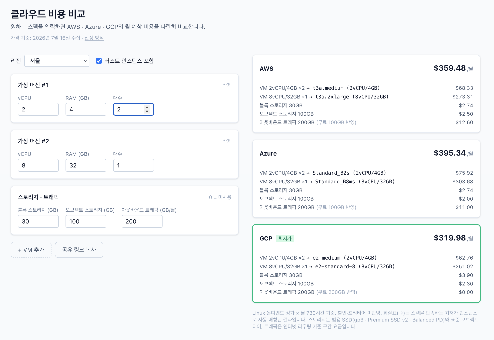

# howmuchcloud

**워크로드 시나리오를 입력하면 AWS · Azure · GCP 월 예상 비용을 나란히 비교해주는 웹 서비스.**

🔗 **[howmuchcloud.com](https://howmuchcloud.com)**




## 핵심 컨셉

"웹서버 2대 + DB 1대 + 스토리지 500GB + 월 트래픽 1TB" 같은 시나리오를 넣으면 3사 월 비용이 한 화면에 나온다. 사용자는 vCPU/RAM만 지정하면 각 플랫폼에서 그 스펙을 만족하는 최저가 인스턴스가 자동 매칭된다.

가격 데이터는 3사 공식 가격 API에서 **매일 자동 수집**한다. 서버·DB 없이 돌아가는 구조가 특징:

> 데이터 갱신 = 봇 커밋 = 재배포. 가격 이력은 git 히스토리가 대신한다.

- GitHub Actions cron이 매일 [collector/](collector/)를 실행해 가격을 수집·정규화·검증
- 결과를 [data/](data/)에 JSON 스냅샷으로 커밋 → push가 Vercel 재배포를 트리거
- 견적 계산은 전부 클라이언트에서 수행 (정적 페이지 + JSON만 서빙)

## 기술 스택

Next.js 16 · React 19 · Tailwind CSS 4 · JSON 스냅샷(DB 없음) · GitHub Actions cron · Vercel

## 시작하기

```bash
npm install
npm run dev        # http://localhost:3000
```

```bash
npm run collect    # 3사 가격 수집 (GCP는 .env에 GCP_API_KEY 필요)
npm test           # 견적 엔진·수집기 테스트
npm run typecheck
```

## 문서

- [docs/ARCHITECTURE.md](docs/ARCHITECTURE.md) — 시스템 구성, 데이터 갱신 흐름, 스키마
- [docs/PLANNING.md](docs/PLANNING.md) — 기획서 (문제 정의, 타겟 사용자, 로드맵)
- [howmuchcloud.com/methodology](https://howmuchcloud.com/methodology) — 견적 산출 방식 설명
