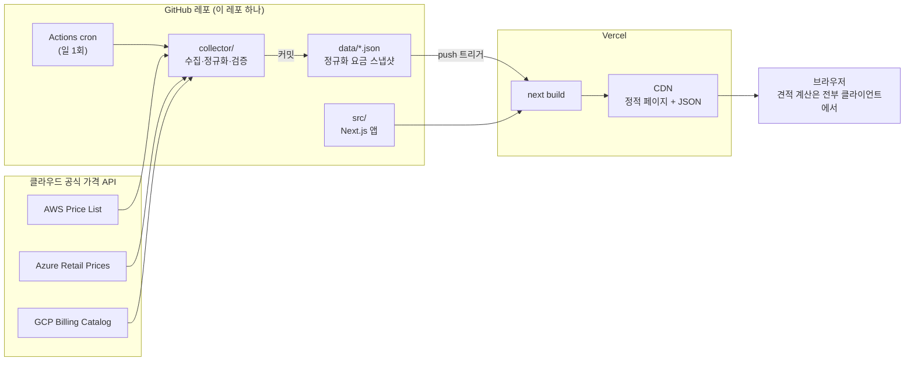
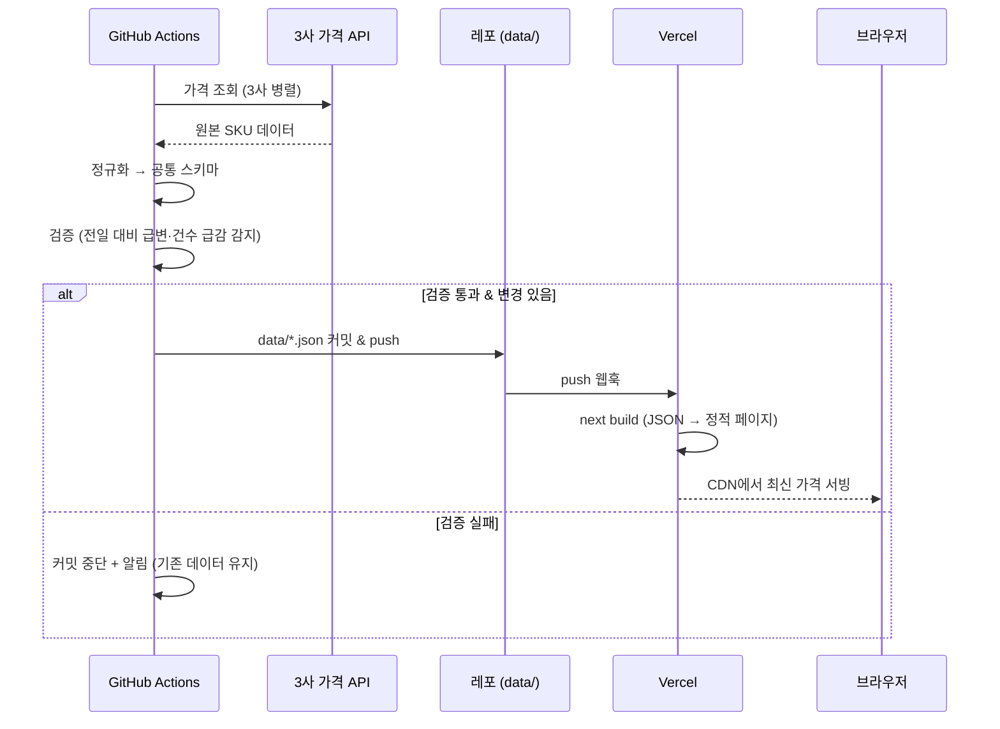
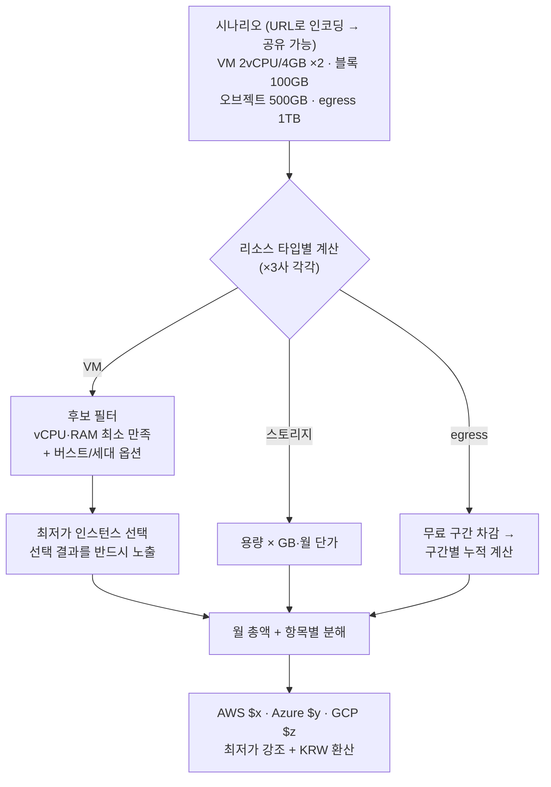

# 설계 문서

> 기획: [PLANNING.md](./PLANNING.md) · 스택: Next.js 풀스택 + JSON 스냅샷(DB 없음) + GitHub Actions cron + Vercel

## 1. 시스템 전체 구성



핵심: **서버·DB 없음.** 데이터 갱신 = 봇 커밋 = 재배포. 가격 이력은 git 히스토리가 대신한다.

## 2. 데이터 갱신 흐름 (일 1회)



- 검증은 갱신 조건이 아니라 **안전장치**다. 가격 ±30% 급변, SKU 건수 급감은 실제 가격 변동이 아니라 수집기 버그(API 응답 형식 변경, 페이지네이션 누락 등)일 확률이 높으므로, 오염된 데이터가 배포되기 전에 차단하고 어제 데이터를 유지한다.
- 알림 = 검증 실패 시 Actions 잡을 실패 처리 → **GitHub 기본 실패 알림(이메일)**. 성공 시엔 알림 없음(알림 피로 방지) — 정상 동작은 봇 커밋 히스토리와 사이트의 수집 시각 배지로 확인.

## 3. 레포 구조

```
cloud-cost/
├── .github/workflows/
│   └── collect.yml          # cron 워크플로우 (일 1회 + 수동 실행)
├── collector/               # 수집기 — Next.js와 독립 실행 (npm run collect)
│   ├── providers/
│   │   ├── aws.ts           # 원본 API → 공통 스키마
│   │   ├── azure.ts
│   │   └── gcp.ts           # ⚠ 난이도 최고 → 프로토타입 1순위
│   ├── validate.ts          # 급변·누락 감지
│   └── main.ts
├── data/                    # 봇이 갱신하는 요금 스냅샷 (사람이 편집 금지)
│   ├── meta.json            # 수집 시각, USD/KRW 환율
│   └── {provider}/{region}/
│       ├── vm.json
│       ├── block-storage.json
│       ├── object-storage.json
│       └── egress.json
├── src/
│   ├── app/                 # 라우트 (§6)
│   ├── components/
│   └── lib/
│       ├── schema.ts        # 공통 타입 — collector와 웹이 공유 (§4)
│       ├── pricing.ts       # data/ 로더
│       └── estimator/       # 견적 엔진 — 순수 함수, UI 무관 (§5)
└── docs/
```

- **collector 실행 구조**: 워크플로우는 `npm run collect`(= `collector/main.ts`) 하나만 실행. main.ts가 providers 3개를 병렬 호출 → validate → `data/` 기록. 커밋은 워크플로우의 다음 스텝. 로컬에서도 같은 명령으로 실행 가능(그냥 Node 스크립트).
- **모듈 관계**: `data/*.json` → `pricing.ts`(경로·타입을 아는 유일한 로더) → `estimator/`(순수 함수 계산) → `components/`(표시).

### Next 앱 내부 (src/)

```
src/
├── app/                          # 파일 기반 라우팅 (폴더 = URL)
│   ├── layout.tsx                # 공통 셸 (헤더/푸터, 메타데이터)
│   ├── page.tsx                  # `/` 시나리오 빌더
│   ├── instances/page.tsx        # `/instances` 비교표
│   └── methodology/page.tsx      # `/methodology` 데이터 안내
├── components/
│   ├── scenario/
│   │   ├── ScenarioBuilder.tsx   # 'use client' — 시나리오 상태 + URL 동기화
│   │   ├── ResourceCard.tsx      # 리소스 입력 카드
│   │   └── EstimateResult.tsx    # 3사 견적 카드 + 비용 분해
│   └── instances/
│       └── InstanceTable.tsx     # 필터 가능한 단품 비교표
└── lib/
    ├── schema.ts
    ├── pricing.ts
    └── estimator/
        ├── index.ts              # estimate(scenario, data) 진입점
        ├── match-vm.ts           # VM 매칭 규칙
        ├── egress.ts             # 구간 요금 계산
        └── estimator.test.ts     # 견적 정확성 = 테스트로 보장
```

- 기본은 서버 컴포넌트(빌드 시 HTML로 구움) — `/instances`, `/methodology`는 순수 SSG로 SEO 대응.
- `ScenarioBuilder`만 `'use client'`: 요금표 JSON을 번들에 포함해 내려보내고(v1 규모 수백 KB), 입력 변경 시 브라우저에서 estimator 즉시 재실행 → 서버 왕복 없는 실시간 견적. 매일 재빌드되므로 번들 속 요금표도 항상 최신.

## 4. 데이터 스키마 (`src/lib/schema.ts`)

> **SKU**(Stock Keeping Unit): 과금되는 상품 단위 하나. "서울 리전의 t3.medium, Linux, 온디맨드"가 SKU 1개다. 3사 가격 API가 모두 쓰는 표준 용어.

```ts
type Provider = 'aws' | 'azure' | 'gcp';
type Region = 'seoul' | 'us-east';          // 정규화 리전 키 (아래 매핑표)

/** VM — 가격은 USD, Linux 온디맨드, 시간당 */
interface VmSku {
  provider: Provider;
  region: Region;
  sku: string;              // "t3.medium" | "e2-medium" | "Standard_B2s"
  vcpu: number;
  ramGb: number;
  burstable: boolean;       // 매칭 시 포함/제외 옵션
  generation: string;       // 구세대 필터용
  pricePerHour: number;
}

/** 스토리지 — GB·월 단가 */
interface StorageSku {
  provider: Provider;
  region: Region;
  kind: 'block-ssd'          // VM에 붙는 디스크 (EBS/Managed Disk/PD) — v1은 범용 SSD 고정
      | 'object-standard';   // S3류 오브젝트 스토리지 (S3/Blob/GCS) — v1은 표준 티어만
  pricePerGbMonth: number;
}

/** egress = 클라우드 밖(인터넷)으로 나가는 데이터 전송. 들어오는 건(ingress) 3사 모두 무료, 나가는 것만 GB당 과금 */
interface EgressTier {
  provider: Provider;
  region: Region;
  freeGb: number;           // 월 무료 구간
  tiers: { upToGb: number | null; pricePerGb: number }[];  // null = 무제한
}

/** data/meta.json */
interface Meta {
  collectedAt: string;      // ISO 8601
  usdKrw: { rate: number; at: string };
}
```

**리전 매핑표**

| 정규화 키 | AWS | Azure | GCP |
|---|---|---|---|
| `seoul` | ap-northeast-2 | koreacentral | asia-northeast3 |
| `us-east` | us-east-1 | eastus | us-east1 |

## 5. 견적 엔진 (`src/lib/estimator/`)



- 순수 함수로 작성 (`estimate(scenario, priceData) → Estimate[]`) — 테스트가 곧 검증 수단
- 월 환산: 시간당 가격 × **730시간** 고정
- 시나리오 상태는 URL 쿼리에 인코딩 → 저장 기능 없이 공유 가능. 예: `/?vm=2c4g:2&blk=100&obj=500&eg=1024` — URL 자체가 시나리오 데이터라서 열면 같은 화면이 재구성됨

## 6. 라우트

| 경로 | 렌더링 | 내용 |
|---|---|---|
| `/` | SSG + 클라이언트 계산 | 시나리오 빌더 + 실시간 3사 견적 (핵심 화면) |
| `/instances` | SSG | 인스턴스 단품 비교표 — SEO 랜딩 |
| `/methodology` | SSG | 데이터 출처·수집 시각·계산 방식·한계 고지 |

## 7. 설계 결정 요약

| 결정 | 선택 | 이유 |
|---|---|---|
| 견적 계산 위치 | 클라이언트 | 요금표 몇 MB → 브라우저에서 즉시 재계산, 서버 불필요 |
| 데이터 저장 | git 커밋되는 JSON | DB 오버엔지니어링 회피 + 이력 공짜 |
| 갱신 전략 | 커밋 → 재빌드 (ISR 불사용) | 일 1회 갱신이면 충분, 파이프라인 단순 |
| 수집기 언어 | TypeScript (웹과 동일) | `schema.ts` 타입 공유로 수집↔웹 스키마 불일치 원천 차단 |
| 시나리오 공유 | URL 인코딩 | 계정/DB 없이 공유 가능, v3에서 단축 URL 추가 여지 |
